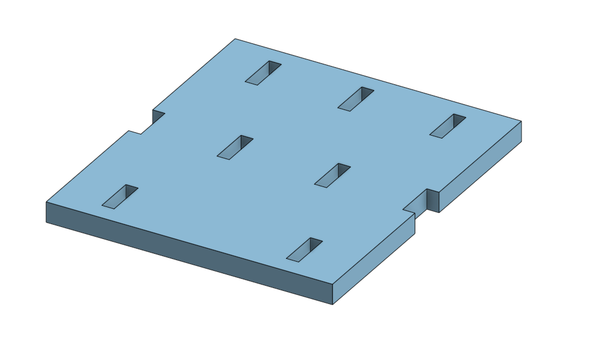

# Lightweight TT Motor Chassis Design

## Overview
This project presents a **single-part chassis design** for TT motors.  
The design was created without performing any mechanical assembly and focuses on meeting strict weight and size constraints.

## Design Objectives
- Design a lightweight chassis suitable for TT motors.
- Ensure total weight does not exceed **13 grams**.
- Keep overall dimensions within **120 × 100 mm**.
- Validate the design using a slicer before fabrication.

## Slicer Software & Print Settings
The design was prepared and validated using **Eufy Make** slicer software with the following settings:

### Material
- **Material Type:** LPA (Black)
- 

  **Reason:**  
  The chassis does not require high mechanical strength or heat resistance.  
  Since ABS-level properties are not necessary for this application, LPA was selected as a lightweight and suitable material for rapid prototyping.

### Layer Height
- **Layer Height:** 0.1 mm
 
  **Reason:**  
  A small layer height improves surface quality and dimensional accuracy, which is important for motor mounting and fit without significantly increasing weight.

### Infill Settings
- **Sparse Infill Pattern:** Triangles
 
  **Reason:**  
  The triangular infill provides a good balance between structural support and material reduction, helping to keep the overall weight below the required limit.

## The final weight
 

## Onshape Link
[View Chassis Design on Onshape](https://cad.onshape.com/documents/34c707881706398cd16b87a3/w/393acf8edfed52a665db1550/e/d15ba09a15af12f08a5c99f0?renderMode=0&uiState=697a22703009221ad19c221a)

## Design Preview

